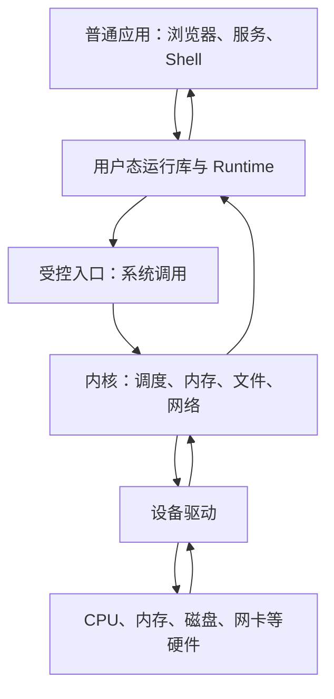
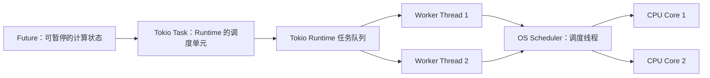
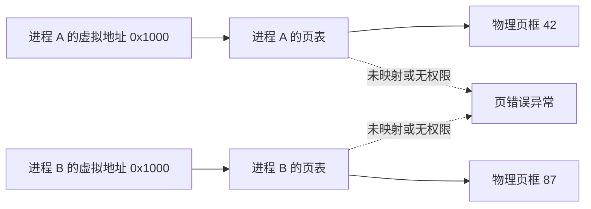

# Rust 操作系统基础认知文档 Implementation Plan

> **For agentic workers:** REQUIRED SUB-SKILL: Use superpowers:subagent-driven-development (recommended) or superpowers:executing-plans to implement this plan task-by-task. Steps use checkbox (`- [ ]`) syntax for tracking.

**Goal:** 在 Obsidian 中创建一篇让有 Java/C++/Rust、线程、Tokio 与网络服务经验，但没有操作系统基础的学习者能够读懂的《Rust 操作系统基础认知地图》，并与既有 Tokio 笔记建立双向知识链接。

**Architecture:** 正文采用“分层地图 → 两个运行故事 → 15 张组件卡片 → 实现顺序与自测”的单文档结构。快速路线只依赖总地图、两个故事和每张卡片开头的 30 秒结论；完整路线再展开固定七问。既有 Tokio 笔记只追加一条反向链接，项目仓库只记录设计、实施计划和项目状态，不复制 Obsidian 正文。

**Tech Stack:** Markdown、Obsidian WikiLink、Mermaid、`rg`、`awk`、`shasum`、`apply_patch`

---

## 实施边界与文件结构

**创建：**

- `/Users/xulei/Library/Mobile Documents/iCloud~md~obsidian/Documents/项目学习/Rust 操作系统基础认知地图.md`：唯一的学习正文，包含阅读路线、总地图、运行故事、15 张组件卡片、术语表和自测。

**修改：**

- `/Users/xulei/Library/Mobile Documents/iCloud~md~obsidian/Documents/项目学习/Tokio 中的 Task、Future 与线程.md`：只在“相关文档”中追加指向操作系统认知地图的反向链接。
- `/Users/xulei/.dev/os/PROJECT_PROGRESS.md`：执行完成后记录正文已生成和验收状态。
- `/Users/xulei/.dev/os/PROJECT_TODO.md`：执行完成后把下一步改为阅读快速路线和口头理解检查。

**不修改：**

- `Cargo.toml`、`rust-toolchain.toml`、`labs/`、`freestanding/` 和任何内核代码。
- `BridgeHub Phase 0A 从零手敲教程.md` 与 `BridgeHub Git 分支学习策略.md`，它们没有本次需要新增的直接知识关系。
- 本实施计划自身的复选框；执行进度使用会话计划跟踪，避免给最终仓库状态制造额外改动。

**正文非目标：**

- 不提供可复制的内核代码，也不要求执行 Cargo、rustup、bootloader 或 QEMU 配置。
- 不深入多核缓存一致性、NUMA、TCP 拥塞控制、图形栈、USB 或具体磁盘格式。
- 不把 Linux 的具体实现写成所有操作系统唯一正确的实现。

Obsidian 的“项目学习”目录不是 Git 仓库。不要为了获得 Git 历史而把正文复制到项目仓库；每个正文任务以静态检查作为检查点，最后只提交仓库中的项目记忆文件。

## 全文固定结构

15 张卡片分别使用唯一标题 `### 组件卡片 01：……` 至 `### 组件卡片 15：……`，标题文字必须与 Task 1 快速路线中的 15 个内部链接完全一致。每张卡片必须依次使用以下完全一致的标记：

```markdown
> [!summary] 30 秒结论

**1. 它是什么？**

**2. 为什么需要它？如果没有会怎样？**

**3. 它如何工作？**

**4. 可以怎样类比？**

**5. 类比从哪里开始不准确？**

**6. 用 Rust 写内核时会在哪里遇到它？**

**7. 最容易混淆什么？**
```

每张卡片的类比后必须立刻写清边界。类比用于搭桥，不能替代真实机制。

### Task 1: 创建文档入口与两条阅读路线

**Files:**

- Create: `/Users/xulei/Library/Mobile Documents/iCloud~md~obsidian/Documents/项目学习/Rust 操作系统基础认知地图.md`
- Read: `/Users/xulei/.dev/os/docs/superpowers/specs/2026-07-21-os-foundations-learning-document-design.md`
- Read: `/Users/xulei/Library/Mobile Documents/iCloud~md~obsidian/Documents/项目学习/Tokio 中的 Task、Future 与线程.md`

- [ ] **Step 1: 确认执行前基线**

Run:

```bash
set -euo pipefail
VAULT='/Users/xulei/Library/Mobile Documents/iCloud~md~obsidian/Documents/项目学习'
NEW="$VAULT/Rust 操作系统基础认知地图.md"
TOKIO="$VAULT/Tokio 中的 Task、Future 与线程.md"

test -d "$VAULT"
test ! -e "$NEW"
test -s "$TOKIO"
rg --files -g '*.md' "$VAULT" | sort
rg -n -g '*.md' '^#{1,3} |\[\[[^]]+\]\]' "$VAULT"
rg -nFx '## 四个核心概念' "$TOKIO"
rg -nFx '## Future 并不会自己运行' "$TOKIO"
shasum -a 256 "$TOKIO"
```

Expected: 三个 `test` 都以状态 0 结束；列出执行时实际存在的 Markdown 笔记和它们的标题/WikiLink；两个深链接目标标题均存在；Tokio 笔记的 SHA-256 为 `272f7f73862d57116eec794781ab248ae03cdbb46e24bb00b597b909dc307ec9`。若出现新的操作系统或 Rust 内核相关笔记，先检查知识关系并按 AGENTS 规则补充必要的双向 WikiLink；若新文档已经存在，先检查它是否是本计划的未完成产物，不能覆盖用户原有内容。

- [ ] **Step 2: 用 `apply_patch` 创建标题、导言与关联入口**

写入以下完整开头：

```markdown
# Rust 操作系统基础认知地图

> [!abstract] 先建立地图，再开始手写内核
> 这篇文档不要求你立刻配置工具或复制内核代码。它先帮你看清：一段程序如何经过负责执行指令的 CPU、受操作系统调度的线程、负责分配与隔离的内存机制、应用请求内核的系统调用入口，以及控制设备的驱动，最终完成工作。

你已经掌握的 Rust、线程、Tokio 和网络服务经验不是旁枝，而是理解操作系统的入口。相关基础笔记：[[Tokio 中的 Task、Future 与线程#四个核心概念|Future、Task、Worker Thread 与 Runtime 的区别]]。

## 这篇文档要解决什么

读完快速路线后，你应该能够把一个专业词汇放回整台系统中，知道它在哪一层、解决什么问题、与前后哪些部件协作。读完完整路线后，你应该能够解释后续 Rust 内核课程里的底层词汇和工具为什么出现，而不是只记配置写法。

## 阅读方式

### 快速路线（20–30 分钟）

1. 阅读 [[#先看整台系统：资源管理与隔离]]。
2. 阅读 [[#运行故事一：println! 如何走到终端]]。
3. 阅读 [[#运行故事二：Tokio 网络请求如何等待并醒来]]。
4. 沿着下面 15 个链接，只阅读每张卡片最开头的“30 秒结论”。

- [[#组件卡片 01：CPU、寄存器与特权级]]
- [[#组件卡片 02：程序、进程、线程、Future 与 Task]]
- [[#组件卡片 03：调度器、上下文切换、阻塞与唤醒]]
- [[#组件卡片 04：用户态、内核态与系统调用]]
- [[#组件卡片 05：中断、异常、时钟与页错误]]
- [[#组件卡片 06：物理内存、虚拟内存、页与页表]]
- [[#组件卡片 07：栈、堆与分配器]]
- [[#组件卡片 08：文件、文件描述符与 VFS]]
- [[#组件卡片 09：设备、驱动与 I/O]]
- [[#组件卡片 10：Socket、内核网络栈与网卡]]
- [[#组件卡片 11：竞态、锁、原子操作与临界区]]
- [[#组件卡片 12：IPC、管道、消息与共享内存]]
- [[#组件卡片 13：init、shell、系统服务与应用]]
- [[#组件卡片 14：固件、bootloader 与内核启动]]
- [[#组件卡片 15：no_std、unsafe、ABI、ELF、linker 与 cross compilation]]

### 完整路线（60–90 分钟）

先按快速路线得到全局地图，再顺序阅读全部组件卡片、[[#推荐的手写内核顺序]]、[[#术语表]]和[[#自测题]]。遇到熟悉的 Tokio 概念时，重点看它与操作系统机制的边界，而不是重复背定义。
```

- [ ] **Step 3: 验证入口、路线与新旧知识链接**

Run:

```bash
set -euo pipefail
NEW='/Users/xulei/Library/Mobile Documents/iCloud~md~obsidian/Documents/项目学习/Rust 操作系统基础认知地图.md'

test -s "$NEW"
rg -nFx '# Rust 操作系统基础认知地图' "$NEW"
rg -nFx '### 快速路线（20–30 分钟）' "$NEW"
rg -nFx '### 完整路线（60–90 分钟）' "$NEW"
rg -nF '[[Tokio 中的 Task、Future 与线程#四个核心概念|' "$NEW"
```

Expected: 四次 `rg` 都恰好显示相应标题或链接所在的一行。

### Task 2: 写总地图、启动故事与硬件边界

**Files:**

- Modify: `/Users/xulei/Library/Mobile Documents/iCloud~md~obsidian/Documents/项目学习/Rust 操作系统基础认知地图.md`

- [ ] **Step 1: 写“先看整台系统”并加入完整分层图**

这一节必须先用普通语言给出两个结论：操作系统既是“有限资源的管理者”，也是“互不信任程序之间的隔离边界”；内核是操作系统中拥有最高权限的核心部分，但内核、Linux 内核、Linux 发行版、桌面环境和完整操作系统不是同义词。

使用下面的 Mermaid 图，并在图后按“应用发请求 → 受控入口 → 内核子系统 → 驱动 → 硬件 → 结果返回”的顺序逐步解释：



图后明确：应用不能直接随意操作所有硬件和别的进程内存；内核代表整个系统执行检查、分配和隔离。

- [ ] **Step 2: 写“启动故事：从按下电源到第一个用户进程”**

沿这条唯一主线讲解：上电 → 固件做最初硬件准备 → bootloader 找到并装载内核映像 → CPU 跳入内核入口 → 内核初始化异常、内存、时钟和设备 → 创建 `init` 或第一个用户进程 → 系统服务与 shell/应用启动。

同时解释普通 Rust `main` 默认依赖已经存在的进程、栈、运行库和操作系统启动约定；裸机启动时这些条件不存在，因此必须先有 bootloader、特定入口和初始化代码。不要写 Cargo、rustup、QEMU 或 bootloader 配置命令。

- [ ] **Step 3: 写组件卡片 01**

卡片 01 的 30 秒结论必须是：CPU 真正执行指令，寄存器保存当前执行最紧要的状态，特权级限制一段代码能做什么；操作系统依靠这些硬件规则建立内核态与用户态边界。

七问必须覆盖：指令与程序计数器/栈指针等寄存器的粗粒度作用；为什么普通程序不能拥有最高权限；网络线程可类比为工人，但 CPU 是执行指令的物理资源而不是软件线程；Rust 内核会在入口、上下文切换和异常处理处接触寄存器；不要深入具体寄存器位。

- [ ] **Step 4: 验证首幅图与组件卡片 01**

Run:

```bash
set -euo pipefail
NEW='/Users/xulei/Library/Mobile Documents/iCloud~md~obsidian/Documents/项目学习/Rust 操作系统基础认知地图.md'

rg -nFx '## 先看整台系统：资源管理与隔离' "$NEW"
rg -nFx '## 启动故事：从按下电源到第一个用户进程' "$NEW"
rg -nFx '### 组件卡片 01：CPU、寄存器与特权级' "$NEW"
test "$(rg -c '^```mermaid$' "$NEW")" -eq 1
```

Expected: 三个标题各出现一次，Mermaid 起始围栏为 1 个。组件卡片 14 延后到 Task 8 写入，使最终文档中的卡片编号保持 01–15 的物理顺序。

### Task 3: 写执行、调度、系统调用与异步事件

**Files:**

- Modify: `/Users/xulei/Library/Mobile Documents/iCloud~md~obsidian/Documents/项目学习/Rust 操作系统基础认知地图.md`
- Reference: `/Users/xulei/Library/Mobile Documents/iCloud~md~obsidian/Documents/项目学习/Tokio 中的 Task、Future 与线程.md`

- [ ] **Step 1: 写“执行与调度”并加入 Tokio 到 CPU 的关系图**

定义必须与既有 Tokio 笔记一致：Future 是可被 `poll` 的计算状态；Tokio Task 是 Runtime 独立调度一个根 Future 的执行单元；Worker Thread 是操作系统线程；操作系统调度器调度线程，CPU 执行线程当前的指令。

使用下面的图，并在图后解释“Task 多于 Worker Thread、Worker Thread 多于或少于 CPU 核心都可能成立”：



在比较段后加入：

```markdown
> 你已经学过的 Tokio 视角：[[Tokio 中的 Task、Future 与线程#四个核心概念|Future、Task、Worker Thread 与 Runtime 的区别]]。这里继续把 Worker Thread 向下连接到操作系统调度器与 CPU。
```

解释 `Pending` 与 Waker 时加入：

```markdown
延伸：[[Tokio 中的 Task、Future 与线程#Future 并不会自己运行|Future 的 poll、Pending 与 Waker]]。
```

- [ ] **Step 2: 写组件卡片 02**

卡片 02 的 30 秒结论必须区分五层：程序是静态代码；进程是带独立资源与地址空间的运行实例；线程是内核调度的执行上下文；Future 保存可暂停计算的状态；Task 让根 Future 可被 Tokio 独立调度。

七问必须覆盖：一个进程可有多个线程，一个线程可轮流执行多个 Task，`.await` 不自动创建新 Task；“任务单/工人/店铺”的类比边界；Rust 内核后续会先实现任务/线程抽象，不会实现 Tokio。

- [ ] **Step 3: 写组件卡片 03**

卡片 03 的 30 秒结论必须是：调度器决定哪个可运行线程得到 CPU；上下文切换保存旧执行状态并恢复新状态；阻塞把暂时不能继续的线程移出可运行集合，事件发生后再唤醒。

七问必须覆盖：可运行/运行中/阻塞三种粗粒度状态、时间片和时钟中断、上下文切换有成本、Tokio 调度 Task 与内核调度线程的共同点和权限边界、Rust 中保存上下文时会接触寄存器和 `unsafe`。

- [ ] **Step 4: 写组件卡片 04**

卡片 04 的 30 秒结论必须是：用户态限制普通应用权限，内核态允许内核管理全机资源，系统调用是应用主动跨越这条边界的受控入口。

七问必须覆盖：参数验证、权限检查、用户指针不能盲目信任；“服务柜台”类比及其无法表达 CPU 特权切换的边界；函数调用不等于系统调用；Rust 内核后续要定义 syscall ABI。

- [ ] **Step 5: 写组件卡片 05**

卡片 05 的 30 秒结论必须区分：系统调用是程序主动请求；中断通常来自硬件或时钟；异常由当前指令触发；页错误是内存访问引发的一类异常。

七问必须覆盖：时钟如何夺回 CPU、设备完成如何通知内核、异常可表示错误也可被系统用于正常机制、页错误与普通 Rust panic 不同、中断处理期间共享状态的额外风险。

- [ ] **Step 6: 验证四张卡片、图和两个深链接**

Run:

```bash
set -euo pipefail
NEW='/Users/xulei/Library/Mobile Documents/iCloud~md~obsidian/Documents/项目学习/Rust 操作系统基础认知地图.md'

rg -nFx '## 执行与调度' "$NEW"
for n in 02 03 04 05; do
  rg -n "^### 组件卡片 $n：" "$NEW"
done
test "$(rg -c '^```mermaid$' "$NEW")" -eq 2
rg -nF '[[Tokio 中的 Task、Future 与线程#四个核心概念|' "$NEW"
rg -nF '[[Tokio 中的 Task、Future 与线程#Future 并不会自己运行|' "$NEW"
```

Expected: 稳定章节标题出现一次，卡片 02–05 各出现一次，Mermaid 总数为 2，两个深链接都能找到。

### Task 4: 写内存、地址空间、栈与堆

**Files:**

- Modify: `/Users/xulei/Library/Mobile Documents/iCloud~md~obsidian/Documents/项目学习/Rust 操作系统基础认知地图.md`

- [ ] **Step 1: 写内存章节并加入地址映射图**

使用下面的图，图后沿“进程生成虚拟地址 → CPU 查页表 → 得到物理页框 → 访问内存；映射不存在或权限不符 → 页错误”逐步解释：



明确写出：Rust 所有权主要约束一个程序中值的合法使用；页表和 CPU 权限位在运行时隔离地址空间。两者互补，但不是同一层的安全机制。

- [ ] **Step 2: 写组件卡片 06**

卡片 06 的 30 秒结论必须是：物理内存是真实 RAM，进程使用的是虚拟地址；页表把一页页虚拟地址映射到物理页框，并附带读写执行权限，从而支持隔离和灵活分配。

七问必须覆盖：页、页框、地址空间、映射、权限和页错误；“每个住户有自己的房间编号表”类比及其边界；相同虚拟地址可映射到不同物理页；Rust 内核会先管理物理页再建立页表。

- [ ] **Step 3: 写组件卡片 07**

卡片 07 的 30 秒结论必须是：栈适合函数调用和生命周期规则清晰的局部状态，堆适合大小或生命周期更灵活的对象，分配器负责追踪哪些堆区间空闲；内核也必须自己提供这些机制。

七问必须覆盖：每个线程通常有自己的栈、栈溢出、内核早期可能没有堆、`Box`/`Vec` 依赖分配器；“桌面与仓库”类比不能表示真实地址增长方向或性能保证；不要把 Rust 所有权等同于内存分配器。

- [ ] **Step 4: 验证内存图与两张卡片**

Run:

```bash
set -euo pipefail
NEW='/Users/xulei/Library/Mobile Documents/iCloud~md~obsidian/Documents/项目学习/Rust 操作系统基础认知地图.md'

rg -nFx '## 内存：地址不是你以为的那块 RAM' "$NEW"
rg -nFx '### 组件卡片 06：物理内存、虚拟内存、页与页表' "$NEW"
rg -nFx '### 组件卡片 07：栈、堆与分配器' "$NEW"
test "$(rg -c '^```mermaid$' "$NEW")" -eq 3
rg -n '所有权.*页表|页表.*所有权' "$NEW"
```

Expected: 三个标题各出现一次，Mermaid 总数为 3，至少一行直接比较所有权与页表。

### Task 5: 写 `println!` 故事、文件与设备

**Files:**

- Modify: `/Users/xulei/Library/Mobile Documents/iCloud~md~obsidian/Documents/项目学习/Rust 操作系统基础认知地图.md`

- [ ] **Step 1: 写运行故事一并加入调用链图**

明确选择“普通 Linux 图形终端中的标准输出”作为故事场景，并说明这是教学主线而非所有环境的唯一实现。使用下面的图：


图后逐步说明每一跳，并写出三条边界：stdout 可以重定向到文件或管道；缓冲策略会随环境变化；教学型裸机内核早期的 `println!` 往往直接写串口或显存，不会拥有这条完整用户态路径。

- [ ] **Step 2: 写文件与设备章节及组件卡片 08**

先加入精确标题 `## 文件与设备`。

卡片 08 的 30 秒结论必须是：文件描述符是进程手里的小整数句柄，内核用它找到真实的文件、管道、Socket 或终端对象；VFS 统一路径与不同文件系统的文件操作，Unix 风格的 fd 接口还让多种内核对象呈现相似的读写方式，但不会把它们都变成磁盘文件。

七问必须覆盖：fd 只在所属进程语境中有意义、`0/1/2` 的常见约定、路径名与打开后的 fd 不同；目录把名字组织成层级并参与路径解析，它不是“装着文件内容的普通盒子”；“取号牌”类比不能表达权限、偏移和并发状态；VFS 不是磁盘格式；Rust 内核会设计句柄表和统一 trait/接口。

- [ ] **Step 3: 写组件卡片 09**

卡片 09 的 30 秒结论必须是：设备是硬件或内核暴露的 I/O 对象，驱动知道如何操纵具体设备，内核其余部分通过较稳定的接口使用驱动；缓冲和阻塞/唤醒把设备速度差异隐藏起来。

七问必须覆盖：字符设备与块设备的粗略区别、寄存器/内存映射 I/O 只作概念介绍、中断通知完成、驱动 bug 可危及整个内核；阻塞 I/O 会让调用线程在结果可用前停止推进，异步/非阻塞路径让线程先做别的工作并在就绪后恢复任务，但不会让硬件本身凭空变快；“翻译员”类比不能表达 DMA、并发和硬件时序；不要把驱动与设备本身混为一谈。

- [ ] **Step 4: 验证故事、第四幅图与两张卡片**

Run:

```bash
set -euo pipefail
NEW='/Users/xulei/Library/Mobile Documents/iCloud~md~obsidian/Documents/项目学习/Rust 操作系统基础认知地图.md'

rg -nFx '## 运行故事一：println! 如何走到终端' "$NEW"
rg -nFx '### 组件卡片 08：文件、文件描述符与 VFS' "$NEW"
rg -nFx '### 组件卡片 09：设备、驱动与 I/O' "$NEW"
test "$(rg -c '^```mermaid$' "$NEW")" -eq 4
rg -n 'stdout.*重定向|重定向.*stdout' "$NEW"
rg -n '串口|显存' "$NEW"
rg -n '目录.*路径|路径.*目录' "$NEW"
rg -n '阻塞 I/O.*异步|异步.*阻塞 I/O' "$NEW"
```

Expected: 故事和两张卡片标题各一次，Mermaid 总数为 4，同时能找到重定向边界、教学内核输出差异、目录/路径关系和阻塞/异步 I/O 对比。

### Task 6: 写 Tokio 网络运行故事与网络卡片

**Files:**

- Modify: `/Users/xulei/Library/Mobile Documents/iCloud~md~obsidian/Documents/项目学习/Rust 操作系统基础认知地图.md`

- [ ] **Step 1: 写运行故事二**

故事从已经拥有 Socket 后发送请求字节开始，再追踪一次非阻塞响应读取；不展开建连、DNS、TLS、HTTP 或 TCP 拥塞控制。按以下顺序逐跳解释：

1. Worker Thread `poll` Tokio Task 中的网络 Future。
2. Future 通过非阻塞 `write/send` 系统调用提交请求字节；内核网络栈把数据组织并交给网卡驱动和网卡发送。
3. Task 随后通过非阻塞 `read/recv` 系统调用尝试读取响应；Socket 暂无数据，内核报告“现在不能完成”，Future 返回 `Pending`。
4. Runtime 通过受控系统调用把 Socket 的就绪兴趣登记到操作系统 I/O 等待机制，并让 Worker Thread 执行其他 Task。
5. 网卡收到响应数据，通过驱动和中断/轮询进入内核网络栈。
6. 内核处理协议状态，把数据放入 Socket 接收缓冲区并把它标记为可读。
7. 操作系统就绪机制唤醒 Runtime；Waker 使 Task 重新进入可运行队列。
8. 某个 Worker Thread 再次 `poll`，`read/recv` 取得数据，Task 继续业务逻辑。

明确区分三种“等待”：Task 的 Future 处于 `Pending`；Worker Thread 没有被这个 Task 阻塞；内核保存 Socket 的等待/就绪状态。说明 Linux 常见 `epoll`、macOS 常见 `kqueue` 只是具体实现例子，主线使用“就绪通知机制”这个通用概念。

- [ ] **Step 2: 写网络章节及组件卡片 10**

先加入精确标题 `## 网络`。

卡片 10 的 30 秒结论必须是：Socket 是应用访问网络通信状态的内核句柄；内核网络栈处理协议与缓冲；网卡和驱动负责把数据包送入或送出机器，应用不直接操作网卡。

七问必须覆盖：Socket 常通过 fd 暴露、接收/发送缓冲、网络栈、网卡驱动与中断；“邮箱”类比不能表达连接状态、流控和包丢失；Socket 不等于 TCP 连接；Rust 内核早期网络阶段依赖中断、内存、驱动和调度基础。

- [ ] **Step 3: 验证网络故事的完整路径和排除范围**

Run:

```bash
set -euo pipefail
NEW='/Users/xulei/Library/Mobile Documents/iCloud~md~obsidian/Documents/项目学习/Rust 操作系统基础认知地图.md'

rg -nFx '## 运行故事二：Tokio 网络请求如何等待并醒来' "$NEW"
rg -nFx '### 组件卡片 10：Socket、内核网络栈与网卡' "$NEW"
story=$(awk '
  $0 == "## 运行故事二：Tokio 网络请求如何等待并醒来" { inside=1 }
  inside && /^## / && $0 != "## 运行故事二：Tokio 网络请求如何等待并醒来" { exit }
  inside { print }
' "$NEW")
for term in 'Future' 'Pending' 'Worker Thread' '系统调用' 'write/send' 'read/recv' '就绪' 'Waker' '驱动' '内核网络栈' 'Socket' '网卡'; do
  printf '%s\n' "$story" | rg -nF "$term" >/dev/null
done
printf '%s\n' "$story" | rg -n '不展开.*DNS.*TLS.*HTTP|不讨论.*DNS.*TLS.*HTTP'
```

Expected: 两个标题各出现一次；12 个路径词汇都在网络故事本身出现；故事明确排除 DNS、TLS 和 HTTP 细节。

### Task 7: 写并发、IPC、用户空间与 AI runtime 边界

**Files:**

- Modify: `/Users/xulei/Library/Mobile Documents/iCloud~md~obsidian/Documents/项目学习/Rust 操作系统基础认知地图.md`

- [ ] **Step 1: 写组件卡片 11**

卡片 11 的 30 秒结论必须是：竞态发生在结果依赖不可控执行时序时；临界区是必须作为整体保护的共享状态操作；锁和原子操作是两类同步工具，内核还要考虑中断在任意时刻进入。

七问必须覆盖：数据竞争与更广义竞态的区别、锁保护不变量而不只是某个变量、原子不等于整个算法自动安全、单核关中断与多核同步不是一回事；交通路口类比不能表示内存顺序；Rust 的 `Send`/`Sync` 不能消除所有逻辑竞态。

- [ ] **Step 2: 写组件卡片 12**

卡片 12 的 30 秒结论必须是：IPC 让相互隔离的进程受控地交换数据或共享资源；管道传字节流，消息传递保留消息边界，共享内存速度快但必须额外同步。

七问必须覆盖：隔离为何导致需要 IPC、复制与共享的权衡、管道/消息/共享内存的最小区别；“办公室传文件”类比不能表达内核缓冲和权限；线程间通信不等于进程间通信；Rust 内核会先实现简单句柄与阻塞/唤醒再扩展 IPC。

- [ ] **Step 3: 写组件卡片 13**

卡片 13 的 30 秒结论必须是：内核提供受保护的基础机制；`init` 启动和管理用户空间；shell 接收命令；系统服务与普通应用在用户态使用内核服务，共同组成可用系统。

七问必须覆盖：内核不等于发行版、shell 不等于内核、系统服务也是进程；“城市基础设施与居民”类比边界；AI runtime 首先作为受限制用户态服务，以进程权限、地址空间、文件描述符和 IPC 接入系统，崩溃时不应直接拖垮内核。

- [ ] **Step 4: 写并发与用户空间的串联说明并验证**

在三张卡片前加入 `## 并发、进程通信与用户空间`，用一个网络服务例子串起线程共享状态、锁、进程隔离、IPC 和系统服务。明确指出内核中的共享状态还可能同时被线程和中断处理路径访问。

Run:

```bash
set -euo pipefail
NEW='/Users/xulei/Library/Mobile Documents/iCloud~md~obsidian/Documents/项目学习/Rust 操作系统基础认知地图.md'

for n in 11 12 13; do
  rg -n "^### 组件卡片 $n：" "$NEW"
done
rg -n 'AI runtime.*用户态|用户态.*AI runtime' "$NEW"
rg -n '线程.*中断|中断.*线程' "$NEW"
```

Expected: 三张卡片各出现一次，同时能找到 AI runtime 的用户态边界和线程/中断共享状态说明。

### Task 8: 写启动卡片、Rust 词汇桥梁、实现顺序与术语表

**Files:**

- Modify: `/Users/xulei/Library/Mobile Documents/iCloud~md~obsidian/Documents/项目学习/Rust 操作系统基础认知地图.md`

- [ ] **Step 1: 写组件卡片 14**

先加入精确标题 `## Rust 内核词汇桥梁`。

卡片 14 的 30 秒结论必须是：固件让机器达到可继续启动的最低状态，bootloader 把内核放进内存并交出控制权，内核入口才是我们自己代码真正开始接管机器的位置。

七问必须覆盖：固件、bootloader、内核映像、内核入口各自职责；餐厅开门准备的类比及其边界；为什么 bootloader 不是内核；Rust 内核的入口函数为何不同于普通 `main`。这一位置紧跟卡片 13，保证最终编号连续。

- [ ] **Step 2: 写组件卡片 15**

卡片 15 的 30 秒结论必须把词汇连成一条因果链：裸机上没有现成操作系统服务，所以内核从 `no_std` 起步；与硬件和外部约定交界处需要小而受控的 `unsafe`；ABI 规定二进制交互方式；ELF 保存可加载映像结构；linker 组合并布局代码；Cargo target 描述要为哪种架构和运行环境生成产物；cross compilation 让 Apple Silicon macOS 宿主按该目标生成 x86_64 裸机代码。

七问必须分别解释 `no_std`、`unsafe`、ABI、ELF、linker、Cargo target 与 cross compilation 的职责，并明确：`unsafe` 不是关闭借用检查器；ELF 不是 bootloader；linker 不是编译器；Cargo target 不是虚拟机；cross compilation 不等于在 macOS 直接运行 x86_64 裸机程序；`no_std` 不等于“没有任何库”。不要出现可执行配置命令。

- [ ] **Step 3: 写推荐实现顺序**

使用以下顺序，每一步都写明依赖的前置概念和可观察结果：

1. 串口输出：依赖启动、CPU、ABI、驱动；结果是 QEMU 中出现确定字符。
2. 异常处理：依赖寄存器、特权级、中断/异常；结果是可控地报告断点或错误。
3. 物理页分配：依赖物理内存、页与启动信息；结果是可重复分配/释放页框。
4. 页表与内核堆：依赖虚拟内存和分配器；结果是映射页面并使用 `Box`/`Vec` 类能力。
5. 时钟与内核任务：依赖中断、上下文和同步；结果是两个任务都能推进。
6. 用户态与系统调用：依赖特权级、地址空间、ABI；结果是受限程序请求内核输出。
7. 文件、设备与文件系统：依赖驱动、VFS、阻塞/唤醒；结果是通过统一句柄读写对象。
8. `init` 与 shell：依赖进程、加载器、系统调用和文件；结果是启动用户程序并接收命令。

这一节只解释顺序，不提供 Cargo、rustup、QEMU 或 bootloader 命令。

- [ ] **Step 4: 写固定最小术语表**

术语表使用三列：`术语`、`一句话解释 / 所属层`、`最容易混淆的对象`。至少包含以下词，不得用“见上文”代替解释：

`操作系统`、`内核`、`用户空间`、`CPU`、`指令`、`寄存器`、`特权级`、`程序`、`进程`、`线程`、`Future`、`Tokio Task`、`Worker Thread`、`Runtime`、`调度器`、`时间片`、`上下文切换`、`阻塞`、`唤醒`、`用户态`、`内核态`、`系统调用`、`中断`、`异常`、`时钟中断`、`页错误`、`物理内存`、`虚拟地址`、`地址空间`、`页`、`页表`、`栈`、`堆`、`分配器`、`文件`、`目录`、`文件描述符`、`VFS`、`设备`、`驱动`、`字符设备`、`块设备`、`缓冲`、`阻塞 I/O`、`异步 I/O`、`Socket`、`内核网络栈`、`网卡`、`竞态`、`临界区`、`锁`、`原子操作`、`中断屏蔽`、`IPC`、`管道`、`消息传递`、`共享内存`、`固件`、`bootloader`、`内核入口`、`init`、`shell`、`系统服务`、`no_std`、`unsafe`、`ABI`、`ELF`、`linker`、`Cargo target`、`cross compilation`。

- [ ] **Step 5: 验证两张卡片、Rust 桥梁、实现顺序和术语覆盖**

Run:

```bash
set -euo pipefail
NEW='/Users/xulei/Library/Mobile Documents/iCloud~md~obsidian/Documents/项目学习/Rust 操作系统基础认知地图.md'

rg -nFx '### 组件卡片 14：固件、bootloader 与内核启动' "$NEW"
rg -nFx '### 组件卡片 15：no_std、unsafe、ABI、ELF、linker 与 cross compilation' "$NEW"
rg -nFx '## Rust 内核词汇桥梁' "$NEW"
rg -nFx '## 推荐的手写内核顺序' "$NEW"
rg -nFx '## 术语表' "$NEW"
for term in no_std unsafe ABI ELF linker 'Cargo target' 'cross compilation'; do
  rg -nF "$term" "$NEW" >/dev/null
done
if rg -n '^```(bash|sh|shell|zsh|console|toml)([[:space:]]|$)|^[[:space:]]*([$❯][[:space:]]*)?(cargo|rustup|rustc|qemu-system-[^[:space:]]+|brew[[:space:]]+install)([[:space:]]|$)|^\[(workspace|package|dependencies|toolchain)\]' "$NEW"; then
  exit 1
fi
```

Expected: 两张卡片和两个章节标题各出现一次，七个 Rust/二进制词汇都存在；最后的禁止命令检查没有输出并以状态 0 结束。

### Task 9: 写自测、答题要点并建立双向链接

**Files:**

- Modify: `/Users/xulei/Library/Mobile Documents/iCloud~md~obsidian/Documents/项目学习/Rust 操作系统基础认知地图.md`
- Modify: `/Users/xulei/Library/Mobile Documents/iCloud~md~obsidian/Documents/项目学习/Tokio 中的 Task、Future 与线程.md:123`

- [ ] **Step 1: 写 11 道自测题**

创建 `## 自测题`，并在其下创建 `### 问题`。问题必须要求解释关系或追踪路径，而不是默写定义：

1. 为什么说操作系统同时是资源管理者和隔离边界？
2. 从 `println!` 开始，按顺序追踪文字到现代图形终端的路径；stdout 被重定向时哪里改变？
3. Tokio 网络 Future 返回 `Pending` 后，Task、Worker Thread、Runtime 和内核分别做什么？
4. 用同一个网络服务例子区分程序、进程、线程、Future 和 Task。
5. 系统调用、中断和异常是谁发起的，各自为何进入内核？
6. 两个进程使用相同虚拟地址，为什么可以访问不同物理内存？
7. Rust 所有权和页表分别解决哪一层的安全问题？
8. 文件描述符、VFS、驱动和设备在一次 I/O 中如何连接？
9. 锁、原子操作和中断屏蔽为什么不能互相无条件替代？
10. 从上电到 `init`，固件、bootloader 和内核分别做什么？
11. 为什么第一版 AI runtime 更适合放在用户态，而不是直接塞进内核？

- [ ] **Step 2: 写折叠式答题要点**

在 `### 答题要点` 下为每道题分别使用一个 Obsidian 折叠 callout，标题依次为 `> [!check]- 第 1 题答题要点` 至 `> [!check]- 第 11 题答题要点`。每道题给出判定答案是否完整的关键节点，但不要求固定措辞。路径题按顺序列节点；比较题至少列“所属层、调度者/发起者、权限或资源边界”；AI runtime 题至少包含故障隔离、最小权限、可升级性和通过 syscall/IPC 使用内核服务。

- [ ] **Step 3: 在新文档添加相关文档区**

追加以下内容：

```markdown
## 相关文档

- [[Tokio 中的 Task、Future 与线程]]
```

- [ ] **Step 4: 只给既有 Tokio 笔记追加一条反向链接**

在既有 `## 相关文档` 下追加：

```markdown
- [[Rust 操作系统基础认知地图]]：继续学习操作系统中的线程、调度器与 CPU。
```

不要修改文件第 3 行的“所属项目”，因为操作系统认知地图不是该笔记的所属项目。

- [ ] **Step 5: 验证双向链接和旧笔记的最小差异**

Run:

```bash
set -euo pipefail
VAULT='/Users/xulei/Library/Mobile Documents/iCloud~md~obsidian/Documents/项目学习'
NEW="$VAULT/Rust 操作系统基础认知地图.md"
TOKIO="$VAULT/Tokio 中的 Task、Future 与线程.md"
BACKLINK='- [[Rust 操作系统基础认知地图]]：继续学习操作系统中的线程、调度器与 CPU。'

test "$(rg -F -c '[[Tokio 中的 Task、Future 与线程' "$NEW")" -ge 2
test "$(rg -Fxc -- "$BACKLINK" "$TOKIO")" -eq 1
awk -v backlink="$BACKLINK" '
  $0 == "## 相关文档" { inside=1; next }
  inside && /^## / { inside=0 }
  inside && $0 == backlink { found++ }
  END { exit(found == 1 ? 0 : 1) }
' "$TOKIO"
cleaned_hash=$(rg -vFx -- "$BACKLINK" "$TOKIO" | shasum -a 256 | awk '{print $1}')
test "$cleaned_hash" = '272f7f73862d57116eec794781ab248ae03cdbb46e24bb00b597b909dc307ec9'
rg -nFx '## 自测题' "$NEW"
rg -nFx '### 答题要点' "$NEW"
questions=$(awk '
  /^### 问题$/ { inside=1; next }
  /^### / && inside { inside=0 }
  inside && /^[0-9]+\. / { count++ }
  END { print count+0 }
' "$NEW")
test "$questions" -eq 11
for n in {1..11}; do
  test "$(rg -c "^> \[!check\]- 第 $n 题答题要点$" "$NEW")" -eq 1
done
```

Expected: 新文档至少有两处 Tokio WikiLink；旧笔记恰好有一条反向链接；移除该链接后的内容哈希与执行前完全一致；自测区恰好有 11 道问题和 11 组折叠式答题要点。

### Task 10: 做全文验收并更新项目记忆

**Files:**

- Verify: `/Users/xulei/Library/Mobile Documents/iCloud~md~obsidian/Documents/项目学习/Rust 操作系统基础认知地图.md`
- Verify: `/Users/xulei/Library/Mobile Documents/iCloud~md~obsidian/Documents/项目学习/Tokio 中的 Task、Future 与线程.md`
- Modify: `/Users/xulei/.dev/os/PROJECT_PROGRESS.md`
- Modify: `/Users/xulei/.dev/os/PROJECT_TODO.md`

- [ ] **Step 1: 验证 15 张卡片和固定八段结构**

Run:

```bash
set -euo pipefail
NEW='/Users/xulei/Library/Mobile Documents/iCloud~md~obsidian/Documents/项目学习/Rust 操作系统基础认知地图.md'

test "$(rg -c '^### 组件卡片 ' "$NEW")" -eq 15
previous_line=0
for n in {01..15}; do
  test "$(rg -c "^### 组件卡片 $n：" "$NEW")" -eq 1
  match=$(rg -n "^### 组件卡片 $n：" "$NEW")
  line=${match%%:*}
  test "$line" -gt "$previous_line"
  previous_line=$line
done

awk '
function reset() { s0=s1=s2=s3=s4=s5=s6=s7=0 }
function check() {
  if (card != "" && !(s0==1 && s1==1 && s2==1 && s3==1 && s4==1 && s5==1 && s6==1 && s7==1)) {
    print "模板不完整或标记重复：" card > "/dev/stderr"
    bad=1
  }
}
/^### 组件卡片 (0[1-9]|1[0-5])：/ {
  check(); card=$0; reset(); next
}
/^## / || /^### / {
  check(); card=""; reset(); next
}
card != "" && $0 == "> [!summary] 30 秒结论" { s0++ }
card != "" && $0 == "**1. 它是什么？**" { s1++ }
card != "" && $0 == "**2. 为什么需要它？如果没有会怎样？**" { s2++ }
card != "" && $0 == "**3. 它如何工作？**" { s3++ }
card != "" && $0 == "**4. 可以怎样类比？**" { s4++ }
card != "" && $0 == "**5. 类比从哪里开始不准确？**" { s5++ }
card != "" && $0 == "**6. 用 Rust 写内核时会在哪里遇到它？**" { s6++ }
card != "" && $0 == "**7. 最容易混淆什么？**" { s7++ }
END { check(); exit bad }
' "$NEW"
```

Expected: 命令无输出并以状态 0 结束；01–15 编号连续、唯一并按升序排列，每张卡片分别拥有一段摘要和七个固定问题。

- [ ] **Step 2: 验证恰好四幅 Mermaid 且围栏完整**

Run:

```bash
set -euo pipefail
NEW='/Users/xulei/Library/Mobile Documents/iCloud~md~obsidian/Documents/项目学习/Rust 操作系统基础认知地图.md'

awk '
/^```mermaid[[:space:]]*$/ {
  if (inside) { print "Mermaid 围栏发生嵌套" > "/dev/stderr"; bad=1 }
  inside=1; count++; body=0; kind=0; next
}
inside && /^```[[:space:]]*$/ {
  if (!body || !kind) {
    print "第 " count " 幅 Mermaid 为空或没有图类型" > "/dev/stderr"
    bad=1
  }
  inside=0; next
}
inside {
  if ($0 !~ /^[[:space:]]*$/) body=1
  if ($0 ~ /^[[:space:]]*(flowchart|graph|sequenceDiagram|stateDiagram|classDiagram)/) kind=1
}
END {
  if (inside) { print "Mermaid 围栏未闭合" > "/dev/stderr"; bad=1 }
  if (count != 4) { print "Mermaid 数量不是 4：" count > "/dev/stderr"; bad=1 }
  if (!bad) print "mermaid_blocks=" count
  exit bad
}
' "$NEW"
```

Expected: 输出 `mermaid_blocks=4`。随后在 Obsidian 阅读视图逐幅确认：四幅图均能渲染，节点文字可读，每幅图后都有不依赖图本身的逐步文字说明。

- [ ] **Step 3: 验证标题、禁止项与所有 WikiLink 目标**

Run:

```bash
set -euo pipefail
VAULT='/Users/xulei/Library/Mobile Documents/iCloud~md~obsidian/Documents/项目学习'
NEW="$VAULT/Rust 操作系统基础认知地图.md"
TOKIO="$VAULT/Tokio 中的 Task、Future 与线程.md"

for heading in \
  '# Rust 操作系统基础认知地图' \
  '### 快速路线（20–30 分钟）' \
  '### 完整路线（60–90 分钟）' \
  '## 先看整台系统：资源管理与隔离' \
  '## 启动故事：从按下电源到第一个用户进程' \
  '## 执行与调度' \
  '## 内存：地址不是你以为的那块 RAM' \
  '## 运行故事一：println! 如何走到终端' \
  '## 文件与设备' \
  '## 运行故事二：Tokio 网络请求如何等待并醒来' \
  '## 网络' \
  '## 并发、进程通信与用户空间' \
  '## Rust 内核词汇桥梁' \
  '## 推荐的手写内核顺序' \
  '## 术语表' \
  '## 自测题' \
  '## 相关文档'
do
  rg -Fxq -- "$heading" "$NEW"
done

if rg -n '^```(bash|sh|shell|zsh|console|toml)([[:space:]]|$)|^[[:space:]]*([$❯][[:space:]]*)?(cargo|rustup|rustc|qemu-system-[^[:space:]]+|brew[[:space:]]+install)([[:space:]]|$)|^\[(workspace|package|dependencies|toolchain)\]' "$NEW"; then
  exit 1
fi

rg -Fq '[[Tokio 中的 Task、Future 与线程]]' "$NEW"
rg -Fq '[[Rust 操作系统基础认知地图]]' "$TOKIO"
```

Expected: 命令无输出并以状态 0 结束；所有必需章节存在，没有可执行配置命令，两篇相关笔记的双向 WikiLink 均存在。

- [ ] **Step 4: 做两次人工认知审阅**

第一次只沿快速路线阅读，不查看卡片七问。确认每个首次出现的核心术语都能在本句或紧邻段落中得到普通语言解释，两个运行故事可以从应用一路讲到内核与硬件，15 个 30 秒结论单独阅读也不依赖后文。

第二次完整阅读，逐卡确认七问都实质回答而非换句话重复；每个类比后都有边界；Future、Task、Worker Thread 和 Runtime 的定义与既有 Tokio 笔记一致；术语表中每一行都给出所属层和混淆对象；自测答案可以由正文推出。

发现问题时直接用 `apply_patch` 修正文档，然后重新执行 Steps 1–3 的完整命令。

- [ ] **Step 5: 更新项目记忆**

将 `PROJECT_PROGRESS.md` 更新为：最后更新日期 `2026-07-22`；基础认知地图和 Tokio 反向链接已经生成并通过结构验收；配置优先课程仍暂停；当前等待学习者阅读快速路线并做口头理解检查。

将 `PROJECT_TODO.md` 中“设计审阅/生成正文”的事项删除，下一步只保留：阅读快速路线、用自己的话复述两个运行故事、完成口头理解检查；后续仍保留“据此重写阶段 0 教学计划”。

- [ ] **Step 6: 验证仓库只包含计划内的项目记忆改动并提交**

Run:

```bash
set -euo pipefail
cd /Users/xulei/.dev/os
git diff --check
git status --short
git diff -- PROJECT_PROGRESS.md PROJECT_TODO.md
changed=$(git status --porcelain=v1 | awk '{print substr($0,4)}' | sort)
expected=$(printf '%s\n' PROJECT_PROGRESS.md PROJECT_TODO.md | sort)
test "$changed" = "$expected"
```

Expected: 执行阶段只出现 `PROJECT_PROGRESS.md` 与 `PROJECT_TODO.md` 的计划内修改；Obsidian 正文不会出现在仓库状态中。

Commit:

```bash
git add PROJECT_PROGRESS.md PROJECT_TODO.md
git commit -m "docs: record OS foundations guide completion"
```

- [ ] **Step 7: 最终证据检查**

Run:

```bash
set -euo pipefail
cd /Users/xulei/.dev/os
VAULT='/Users/xulei/Library/Mobile Documents/iCloud~md~obsidian/Documents/项目学习'

git status --short --branch
test -z "$(git status --porcelain=v1)"
test -s "$VAULT/Rust 操作系统基础认知地图.md"
rg -nF '[[Rust 操作系统基础认知地图]]' "$VAULT/Tokio 中的 Task、Future 与线程.md"
shasum -a 256 "$VAULT/Rust 操作系统基础认知地图.md" "$VAULT/Tokio 中的 Task、Future 与线程.md"
```

Expected: Git 工作区没有未提交改动；两篇 Obsidian 文档存在且反向链接可找到；输出两个非空 SHA-256，作为本次交付状态的证据。
