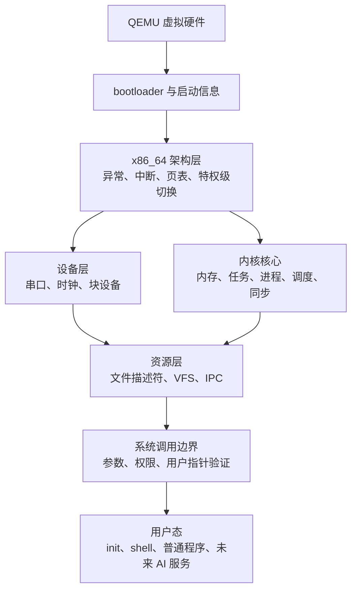

# Rust 类 Unix 内核学习项目设计

- 日期：2026-07-13
- 状态：已批准
- 主机环境：Apple Silicon macOS
- 第一目标架构：x86_64
- 运行环境：QEMU

## 1. 背景与愿景

本项目通过亲手实现一个 Rust 类 Unix 内核，系统学习操作系统原理。长期愿景是探索面向人类与 AI 协作的操作系统，但第一阶段不把模型或 Agent 放进内核，也不以尽快制作 AI 产品为目标。

这里的“写 Linux”被明确为“从零实现一个教学型、独立启动的类 Unix 操作系统”，而不是重写 Linux 源码、兼容 Linux ABI，或开发 Linux 内核模块。

## 2. 学习约束

- 学习者已有 Java、C++ 和 Rust 基础，理解所有权、生命周期、trait 及 Tokio 的基本概念。
- Cargo 和裸机系统编程经验不足，将在项目中补齐。
- 每周可稳定投入 15 小时以上。
- 采用教练式教学：核心实现由学习者完成，导师负责讲解、任务拆分、验收、代码审查和分层提示。
- 是否进入下一阶段由掌握程度决定，不由日历决定。第一版预计用时约 6 至 10 个月。

## 3. 第一版成功标准

第一版必须能够：

1. 在 x86_64 QEMU 中可重复构建并稳定启动，通过串口输出诊断信息。
2. 处理 CPU 异常、时钟和必要的硬件中断。
3. 管理物理内存、虚拟内存和内核堆。
4. 运行多个内核任务，先实现协作式调度，再实现抢占式调度。
5. 进入 Ring 3 用户态，为不同进程提供隔离的地址空间。
6. 提供最小系统调用，包括 `write`、`spawn`、`exit` 和 `wait`。
7. 提供文件描述符、VFS、RAM 文件系统和一个简单的持久化文件系统。
8. 提供可启动程序、读写文件、重定向和连接管道的简单 shell。
9. 通过自动化测试验证正常路径、失败路径和隔离边界。
10. 在出现 panic 或用户态故障时给出足以复现和定位问题的诊断信息。

## 4. 第一版非目标

第一版明确不实现：

- Linux ABI、完整 POSIX 兼容或运行通用 Linux 软件。
- GUI、声音、USB 和广泛的真实硬件驱动。
- 多核、容器、完整网络栈和高性能优化。
- 自制 bootloader。
- 真机启动支持。
- 内核中的 LLM、Agent、prompt、长期记忆或自然语言权限策略。

这些内容只有在第一版验收通过后，才按独立设计周期评估。

## 5. 技术路线

第一版采用 `x86_64 + QEMU + Rust + rust-osdev/bootloader 0.11`。Rust 内核编译到官方 `x86_64-unknown-none` 裸机目标。

默认启动路径使用 bootloader 生成的 BIOS 磁盘镜像，以减少第一里程碑的外部依赖。内核启动接口保持与 firmware 无关；基础启动稳定后，再增加 UEFI 镜像冒烟测试。AArch64 是第一版完成后的第二架构，用于检验架构边界，而不是第一阶段的并行目标。

第一版虚拟硬件基线固定为：COM1 串口作为控制台，8259 PIC 与 PIT 提供第一套中断和时钟路径，持久化存储使用独立的 virtio-blk 测试磁盘。更现代的 APIC、真实硬件驱动和其他设备模型不属于第一版门禁。

Philipp Oppermann 的《Writing an OS in Rust》只作为原理和实验顺序参考。其部分章节固定在 `bootloader 0.9 + bootimage + 自定义 target JSON`，不能通过只修改依赖版本迁移到 0.11。本项目统一使用 0.11 的 `bootloader_api`、官方裸机 target 和磁盘镜像构建流程。

工具链策略如下：

- 在首次端到端启动验证成功时，立即固定一个明确日期的 Rust nightly。
- 固定 bootloader 及其他依赖的精确兼容版本并提交 `Cargo.lock`。
- 禁止在配置中使用浮动的 `nightly` 通道。
- 记录 QEMU 版本和安装方式。
- 升级工具链必须单独提交，并运行完整回归测试。

## 6. 内核架构

第一版采用模块化宏内核。内存、调度、文件系统和驱动运行在同一个内核地址空间，但通过明确接口隔离职责。



### 6.1 模块边界

- `arch/x86_64`：CPU 初始化、GDT、IDT、中断入口、页表原语、上下文切换和特权级转换。架构无关模块不得直接使用 x86_64 寄存器或指令。
- 内存模块：物理页分配、虚拟地址空间、映射和内核堆。它不依赖文件系统或用户界面。
- 任务与进程模块：任务状态、上下文、调度和生命周期。它通过内存模块的公共接口管理地址空间。
- 驱动模块：串口、时钟和块设备。驱动向上提供明确的设备接口，不泄漏散乱的 MMIO 或端口访问。
- VFS 与文件描述符：统一 RAM 文件系统、持久化文件系统、设备和管道的访问模型。
- 系统调用层：验证系统调用号、参数、长度、权限和用户地址，是不信任用户态的安全边界。
- 用户态：`init`、shell、工具程序和后期 AI runtime 均是可限制、可终止的普通进程。

第一版调度策略固定为单核 round-robin：先通过显式让出实现协作式调度，再使用时钟中断触发抢占。优先级、多核负载均衡和实时调度不在第一版范围内。

持久化文件系统使用教学型、无日志的简单格式，至少支持目录、普通文件、创建、读取、覆盖写入和顺序扩展。它运行在单独的 virtio-blk 测试磁盘上，文件系统损坏检测必须返回明确错误；崩溃一致性、权限位、硬链接和稀疏文件不属于第一版。

### 6.2 `unsafe` 边界

`unsafe` 只允许出现在硬件访问、页表、上下文切换、中断入口和用户指针访问等不可避免的位置。每个 `unsafe` 块必须：

1. 写明调用者必须保证的不变量。
2. 说明当前代码为何满足这些不变量。
3. 向上提供尽可能小的安全接口。
4. 在相关不变量发生变化时重新审查。

不得用 `unsafe` 绕过正常的所有权设计，也不得把裸指针扩散到业务模块。

## 7. 关键数据流

### 7.1 启动

```text
QEMU → bootloader → 验证启动信息 → 初始化串口
→ 初始化 CPU 与异常处理 → 初始化内存 → 启动第一个内核任务
```

任何一步失败都必须在可用的最早诊断通道上报告。串口初始化后，串口是第一版的权威日志来源。

### 7.2 系统调用

以 `write` 为例：

```text
用户程序 → 系统调用入口 → 保存用户上下文
→ 验证系统调用号、文件描述符、用户缓冲区和长度
→ 复制或受控访问用户数据 → VFS → 目标驱动或文件
→ 返回结果 → 恢复用户上下文
```

用户提供的地址、长度、文件描述符和枚举值一律视为不可信。验证失败返回明确错误；不得导致内核 panic。

## 8. 课程与里程碑

| 阶段 | 学习重点 | 阶段成果 |
|---|---|---|
| 0. 底层预备 | Cargo、ELF、ABI、指针、栈、`unsafe`、`no_std` | 普通 Rust 环境中的内存、队列和调度模拟实验 |
| 1. 启动 | 交叉编译、bootloader、入口、panic | QEMU 启动，串口打印，panic 可诊断并使测试失败 |
| 2. CPU 与中断 | 特权级、GDT、IDT、异常、时钟 | 捕获断点和页错误，处理稳定的时钟中断 |
| 3. 内存管理 | 物理页、页表、虚拟地址、内核堆 | 分配、映射和释放页面，检测非法访问，启用 `alloc` |
| 4. 内核任务 | 上下文切换、任务状态、同步、调度 | 多任务运行，协作式与抢占式调度均有测试 |
| 5. 用户态 | Ring 3、进程地址空间、ELF、系统调用 | 隔离运行多个用户程序，坏程序只终止自身 |
| 6. 文件与 shell | 文件描述符、VFS、RAMFS、块设备、管道 | shell 启动程序、读写文件、重定向和管道 |
| 7. 工程化 | 自动测试、故障注入、日志、GDB、性能观察 | 一条命令构建并测试，错误可稳定复现 |
| 8. 后续研究 | AArch64 移植、能力权限、审计、资源预算 | 验证可移植性并运行受限制的用户态 AI 服务 |

测试、日志和小提交从阶段 0 开始执行；阶段 7 是对现有工程能力的系统化加固，而不是到最后才开始测试。

## 9. 教练式教学协议

每课固定使用以下循环：

1. 导师讲解一个有限主题，并通过问题检查心智模型。
2. 必要时先在宿主环境编写可测试的小型模拟。
3. 导师给出任务、接口约束、禁止事项和验收标准，不给完整实现。
4. 学习者亲手实现并报告命令、输出和错误。
5. 导师审查代码；需要帮助时按“概念提示 → 方向提示 → 伪代码 → 局部示例”逐级介入。
6. 测试通过后，学习者用自己的话解释控制流、数据结构和安全不变量。
7. 形成一次小而清晰的 Git commit，再进入下一课。

能运行但不能解释的实现不算完成。复制教程代码而无法说明每一层作用，也不算完成。

## 10. 错误处理

- 可恢复错误使用 `Result` 和明确的错误枚举。
- 用户态页错误、非法指令、无效系统调用和坏指针只影响对应进程。
- 内核 panic 只用于无法安全继续的内核不变量破坏。
- panic 必须输出阶段、原因、必要的地址或寄存器信息，并在自动测试中使 QEMU 明确失败。
- 内存不足必须作为可测试状态处理；用户请求导致的内存不足不得默认 panic。
- 驱动和硬件错误不得静默忽略。
- `unwrap` 只允许用于由静态结构明确保证不可能失败的位置，并附简短说明；普通运行时路径使用显式错误处理。

## 11. 测试与调试

### 11.1 测试层次

1. 宿主单元测试：页分配策略、队列、状态机、文件树等纯算法。
2. QEMU 内核集成测试：启动、panic、异常、中断、页表和分配器。
3. 用户隔离负向测试：坏指针、非法系统调用、越权文件描述符和恶意 ELF。
4. 端到端测试：从启动到 shell 执行程序、文件操作、重定向和管道。

每个功能同时包含成功路径和至少一个失败路径。修复缺陷时先增加能复现问题的测试。

### 11.2 调试顺序

调试固定遵循：

```text
最小复现 → 串口日志 → QEMU 状态 → GDB 单步
→ 寄存器与页表检查 → 反汇编
```

禁止通过无目标地改代码、增加延时或吞掉错误来“试出”修复。

## 12. 仓库结构

```text
os/
├── kernel/       # no_std 内核库与入口
├── user/         # 阶段 5 开始加入用户程序
├── xtask/        # 构建镜像、启动 QEMU、运行测试
├── docs/         # 设计、课程笔记和原理说明
├── tests/        # QEMU 端到端测试与测试镜像
├── PROJECT_PROGRESS.md
└── PROJECT_TODO.md
```

第一阶段不预先拆出大量 crate。模块边界稳定、确实需要独立宿主测试或跨架构复用时，才提取公共 crate。

## 13. 阶段门禁

一个阶段只有同时满足以下条件才算完成：

- 从干净环境可重复构建和运行。
- 自动测试全部通过，并覆盖关键失败路径。
- 没有未解释的警告、临时绕过或静默失败。
- 学习者能解释控制流、核心数据结构和安全不变量。
- 文档记录了重要决定和已知限制。
- 代码已经形成可审查的 Git commit。

## 14. AI 原生系统的后续边界

基础 OS 完成后，AI 首先作为非特权用户态服务运行。推荐的长期边界是：

```text
人类意图 → Agent shell → 类型化计划 → 确定性策略检查
→ 必要的人工授权 → 最小能力 → 沙箱执行
→ 审计记录、结果差异与撤销
```

LLM 可以提出计划，但不能自行授予权限。内核只负责确定、可验证、不可绕过的隔离、调度、计量和访问控制机制。

## 15. 主要风险与控制

- 工具链漂移：固定 nightly、依赖、锁文件和 QEMU 版本；升级单独验证。
- 教程照抄：核心代码由学习者完成，每阶段必须口头解释不变量。
- 范围失控：第一版非目标不提前加入；新想法记录到项目待办。
- `unsafe` 扩散：限制边界、记录安全前提、阶段性审查。
- 过早追求真机或多架构：第一版只支持 x86_64 QEMU，完成后再移植。
- AI 愿景干扰内核学习：AI 研究固定在基础 OS 验收之后，以用户态实验起步。

## 16. 一手参考资料

- Rust x86_64 裸机目标：https://doc.rust-lang.org/rustc/platform-support/x86_64-unknown-none.html
- rust-osdev bootloader：https://github.com/rust-osdev/bootloader
- bootloader 0.9 迁移说明：https://github.com/rust-osdev/bootloader/blob/main/docs/migration/v0.9.md
- bootloader 0.11 最小示例：https://github.com/rust-osdev/bootloader/blob/main/examples/basic/basic-os.md
- Writing an OS in Rust：https://os.phil-opp.com/
- QEMU GDB 调试：https://www.qemu.org/docs/master/system/gdb.html
- rCore Tutorial：https://github.com/rcore-os/rCore-Tutorial-Book-v3
